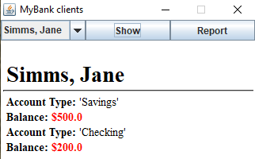
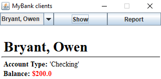
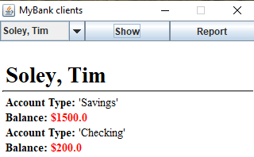
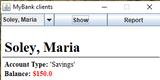
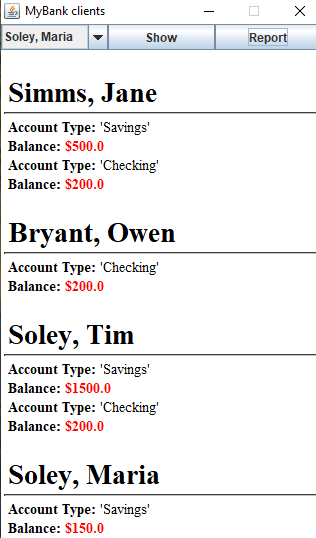

# UI Lab 3

## Завдання (на "п'ять")
* Завантажте jar-файл з усіма потрібними классами (Bank, Customer, Account та ін.) з наших попередніх лаб - MyBank
* Створіть в Netbeans новий проект з назвою GUIdemo (або використайте проект, створений в ході виконання попередньої роботи). УВАГА! Чекбокс Create Main Class треба очистити (не створювати виконуваний клас)!
* Додайте до проекту завантажену вами бібліотеку - правою кнопкой на проекті, обрати Properties, потім у дереві категорій обрати Libraries (другий пункт зверху), натиснути у правій частині вікна кнопку Add JAR/Folder, обрати jar-файл, завантажений у п. 1, натиснути Ok
* Додайте до проекту файл SWINGdemo.java з цього репозиторію
* Вивчіть вихідний код у файлі, впевніться, що ви розумієте як він має працювати
* Запустіть проект у звичайний спосіб. Ви маєте побачити вікно, в якому можна обрати одного з клієнтів банку, і натиснувши кнопку Show, побачити інформацію про нього, перепишіть код так, щоб інформація про клієнтів банку та їх рахунки читалась з файлу test.dat.
* Додайте ще одну кнопку - Report, яка має виводити у нижній частині вікна звіт за клієнтами такого ж виду, як у роботі номер 8 (див. CustomerReport).
* Запустіть проект, впевніться, що все працює як очікувалось. Продемонстрируйте результат викладачеві.
## Результат

